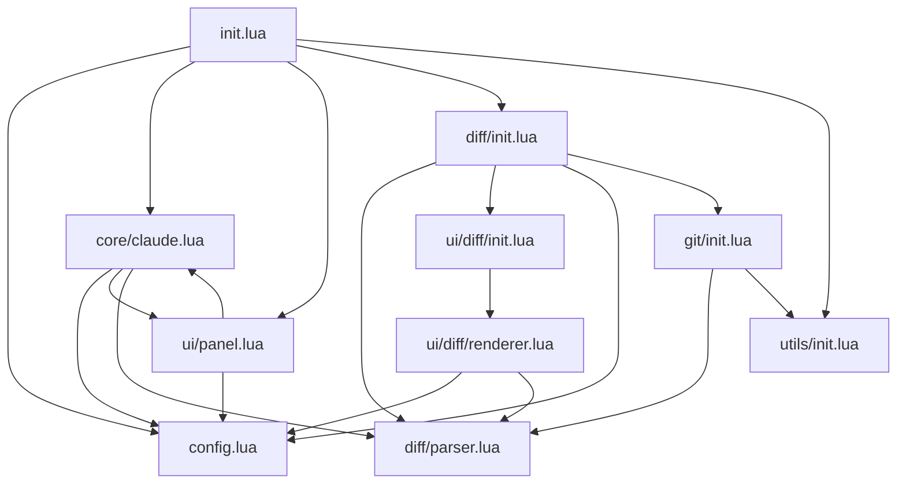

# 🏗️ cc.nvim Architecture Overview

*Architecture Documentation v1.0.0*

## 📁 Directory Structure

```
cc.nvim/
├── lua/cc_nvim/
│   ├── init.lua              # Main entry point
│   ├── config.lua            # Configuration management
│   ├── core/                 # Core functionality
│   │   └── claude.lua        # Claude Code integration
│   ├── ui/                   # User interface
│   │   ├── panel.lua         # Chat panel
│   │   └── diff/             # Diff UI components
│   │       ├── init.lua      # Module entry point
│   │       └── renderer.lua  # Diff renderer
│   ├── diff/                 # Diff processing
│   │   ├── init.lua          # Diff controller
│   │   └── parser.lua        # Diff parser
│   ├── git/                  # Git integration
│   │   └── init.lua          # Git operations
│   └── utils/                # Utilities
│       └── init.lua          # Common utilities
├── plugin/
│   └── cc_nvim.lua           # Plugin initialization
└── doc/
    ├── cc_nvim.txt           # Neovim help
    └── claude/               # Claude Code documentation
```

## 🔄 Module Dependencies



## 🎯 Core Components

### 1. Configuration System (`config.lua`)
- **Purpose**: Centralized configuration management
- **Features**: 
  - Default configuration values
  - User configuration merging
  - Configuration validation
- **Key Functions**:
  - `setup(opts)`: Initialize configuration
  - `get(key)`: Retrieve configuration value

### 2. Claude Integration (`core/claude.lua`)
- **Purpose**: Interface with Claude Code CLI
- **Features**:
  - Async process communication
  - Message handling
  - Change detection and extraction
- **Key Functions**:
  - `start_session()`: Launch Claude Code process
  - `send_message(message)`: Send user input
  - `process_output(data)`: Handle Claude responses

### 3. Diff System (`diff/`)
- **Purpose**: Diff processing and management
- **Components**:
  - `init.lua`: Diff controller and session management
  - `parser.lua`: Parse Claude output and git diffs
- **Key Functions**:
  - `start_diff_mode()`: Initialize diff review
  - `parse_git_diff()`: Parse git diff output
  - `apply_changes()`: Apply accepted changes

### 4. UI Components (`ui/`)
- **Purpose**: User interface rendering
- **Components**:
  - `panel.lua`: Chat panel interface
  - `diff/`: Diff visualization components
- **Key Functions**:
  - `open()`: Display UI components
  - `refresh()`: Update UI state
  - `setup_keymaps()`: Configure key bindings

### 5. Git Integration (`git/init.lua`)
- **Purpose**: Git operations and diff retrieval
- **Features**:
  - Git diff extraction
  - Repository validation
  - Commit information retrieval
- **Key Functions**:
  - `get_git_diff()`: Retrieve git differences
  - `is_git_repository()`: Validate git repo
  - `get_commit_info()`: Fetch commit details

## 🔧 Data Flow

### 1. Claude Code Interaction Flow
```
User Input → panel.lua → core/claude.lua → Claude CLI
                                              ↓
Claude Response → diff/parser.lua → diff/init.lua → ui/diff/renderer.lua
```

### 2. Git Diff Flow
```
User Command → git/init.lua → git diff command → diff/parser.lua
                                                      ↓
Parsed Changes → diff/init.lua → ui/diff/renderer.lua → Display
```

### 3. Configuration Flow
```
User Setup → config.lua → Default Merge → Module Distribution
```

## 🎨 UI Architecture

### Panel System
- **Modal Windows**: Floating windows for diff review
- **Split Panels**: Side panels for chat interface
- **Buffer Management**: Dedicated buffers for different views

### Key Binding System
- **Context-Aware**: Different bindings for different modes
- **Hierarchical**: Global → Mode → Buffer specific
- **Configurable**: User-customizable key mappings

### Visual Feedback
- **Notifications**: Status and error messages
- **Highlighting**: Syntax highlighting for diffs
- **Progress Indicators**: Visual feedback for operations

## 🔒 Security Considerations

### Input Validation
- **File Path Safety**: Validate file paths to prevent traversal
- **Command Injection**: Sanitize inputs to external commands
- **Buffer Overflow**: Limit input sizes and buffer lengths

### Process Management
- **Subprocess Control**: Proper process lifecycle management
- **Resource Limits**: Prevent resource exhaustion
- **Error Isolation**: Isolate errors to prevent crashes

## 📊 Performance Optimization

### Async Operations
- **Non-blocking I/O**: Async communication with Claude CLI
- **Background Processing**: Diff parsing in background
- **UI Responsiveness**: Maintain UI responsiveness during operations

### Memory Management
- **Buffer Cleanup**: Proper cleanup of temporary buffers
- **Session Management**: Manage long-running sessions
- **Garbage Collection**: Efficient memory usage patterns

### Caching Strategy
- **Configuration Cache**: Cache parsed configuration
- **Diff Cache**: Cache parsed diff results
- **Git Cache**: Cache git repository information

## 🚀 Extension Points

### Plugin Hooks
- **Pre/Post Hooks**: Before and after major operations
- **Custom Parsers**: Add support for new diff formats
- **UI Customization**: Custom UI components and themes

### API Design
- **Module Exports**: Clean public API for each module
- **Event System**: Event-driven architecture for loose coupling
- **Configuration Options**: Extensive configuration for customization

## 🧪 Testing Strategy

### Unit Tests
- **Module Testing**: Individual module functionality
- **Mock Objects**: Mock external dependencies
- **Edge Cases**: Test boundary conditions

### Integration Tests
- **End-to-End**: Complete workflow testing
- **CLI Integration**: Test Claude CLI interaction
- **Git Integration**: Test git operations

### Performance Tests
- **Load Testing**: Large file and diff handling
- **Memory Testing**: Memory usage patterns
- **Concurrency**: Multiple operations handling

---

*This architecture documentation provides a comprehensive overview of the cc.nvim plugin structure and design principles. It serves as a reference for developers working on the plugin and for understanding the system's internal workings.*